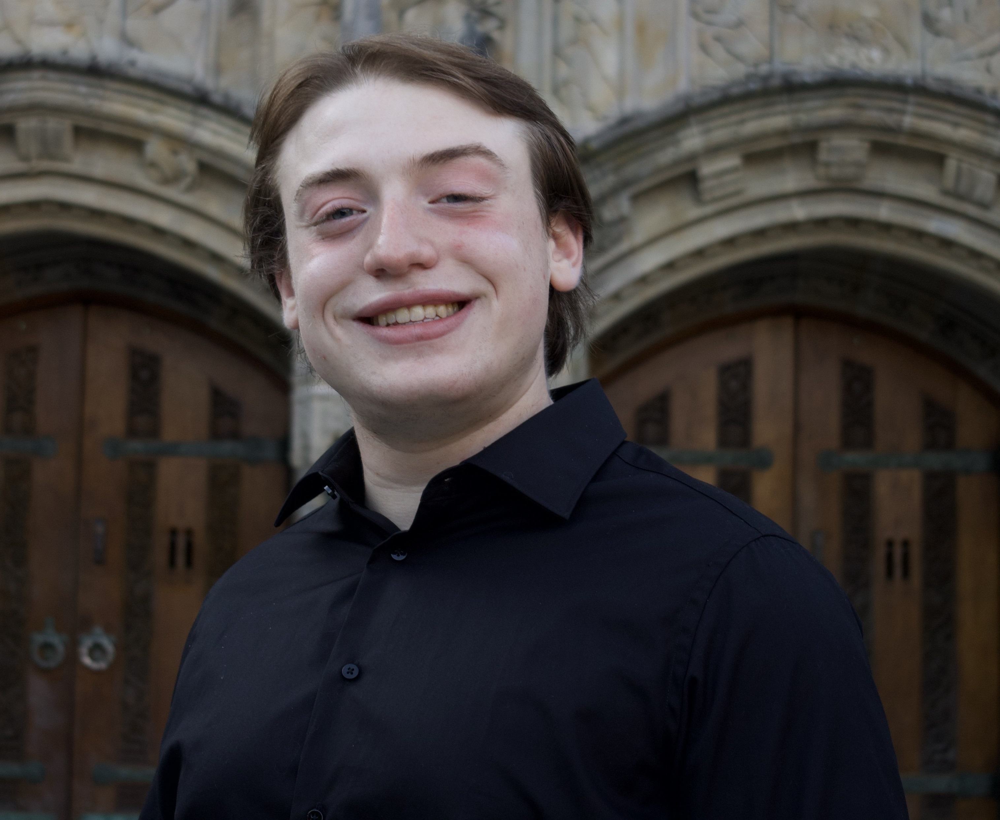

---
# Feel free to add content and custom Front Matter to this file.
# To modify the layout, see https://jekyllrb.com/docs/themes/#overriding-theme-defaults

layout: page
title: About Me
hide_header: true
---
# Hi, I'm Oz

<!--  -->
 

 

I'm a junior at Yale pursuing a BS/MS in Computer Science, with a focus on robotics and machine learning. I’m especially interested in building systems that understand and adapt to people in the real world. In Yale’s Social Robotics Lab, I’ve developed algorithms for behavior prediction and action selection that are 12x more accurate than the previous state-of-the-art, helping robots collaborate more naturally with humans. I also curated a high-quality audiovisual stress dataset and built a fast, accurate stress detection system, and separately, designed control architectures for therapy robots now deployed in hospitals, clinics, and schools.

Outside the lab, I engineer electronics and control systems for a University Rover Challenge-style rover as part of the Yale Undergraduate Aerospace Association, and I’ve previously led backend development for an AI-powered degree auditing tool for Yale students. Most recently, I interned at Outer Labs, where I built systems for encoding procedural knowledge into language models at inference time and autonomously generating knowledge graphs.

