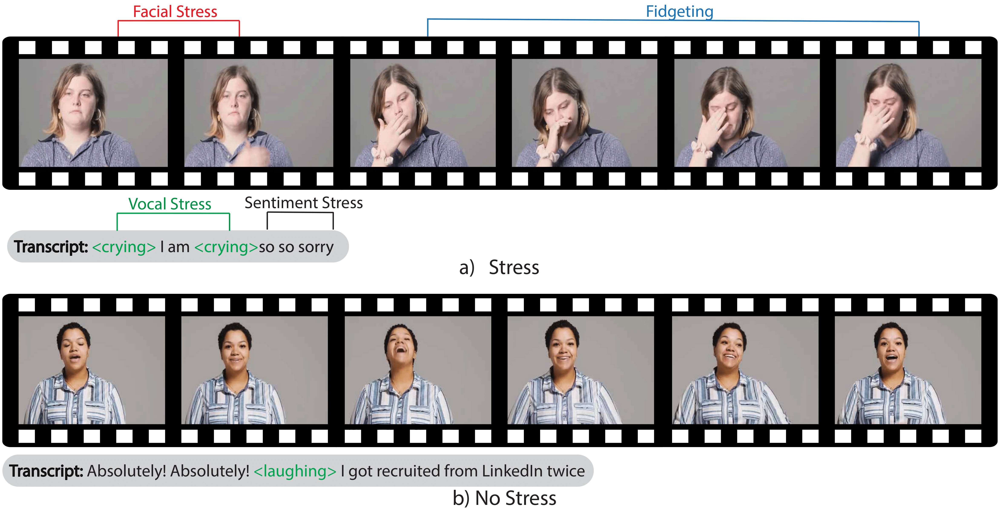
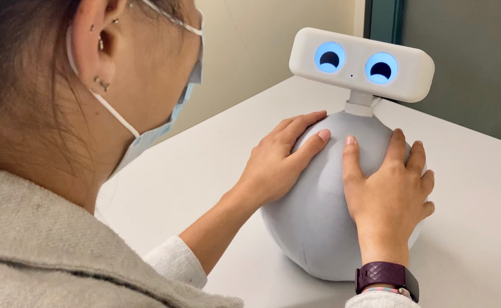
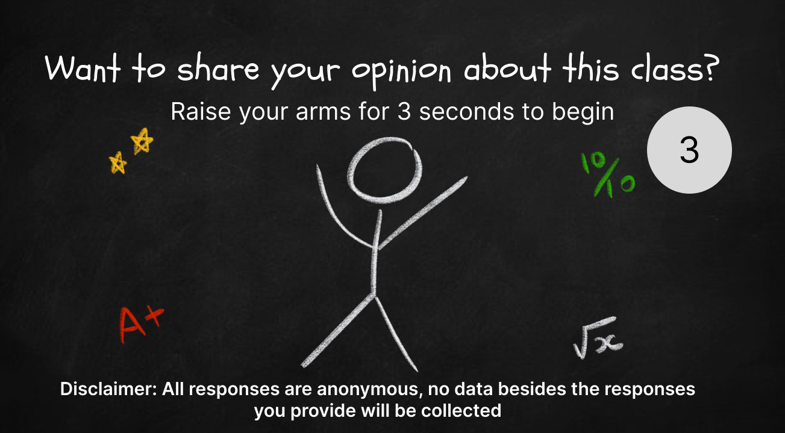

## MAS Dataset

  
I curated a dataset of 353 short clips of people in monologue scenarios experiencing stress. Each clip is annotated for stress across four audio-visual modalities. Labels are high quality, with an inter-rater reliability of 0.85--significantly higher than comparable datasets.

 
 

## Multimodal Stress Detector

  
I designed an audio-visual stress detector that uses late fusion to interpret expressions of stress across multiple modalities. This approach allows the system to combine the strength of multiple modalities while maintaining robust performance even when some are unavailable. This system achieved an F1 score of 0.85 on the MAS dataset and is currently being investigated for use in detecting and correcting implicit bias

 
 

## Ommie

  
I helped write the control architecture of Ommie, a therapy robot being deployed in hospitals, wellness clinics, schools, and in the home. My changes to the high-level behavior loops and lower-level hardware drivers drastically improved Ommie's maximum continuous runtime, uncapping it from less than five minutes to virtually unlimited

 
 

## Real-Time Course Feedback

  
I led a team of undergrads to design a system that allowed students to give feedback on a class in real-time using a Kinect body-tracking system installed outside the lecture hall. Professors were also able to view aggregate statistics about their class, helping them to improve their teaching lecture-to-lecture. Out of 36 teams, our project won the class choice award for CPSC 484: Human-Computer Interaction.