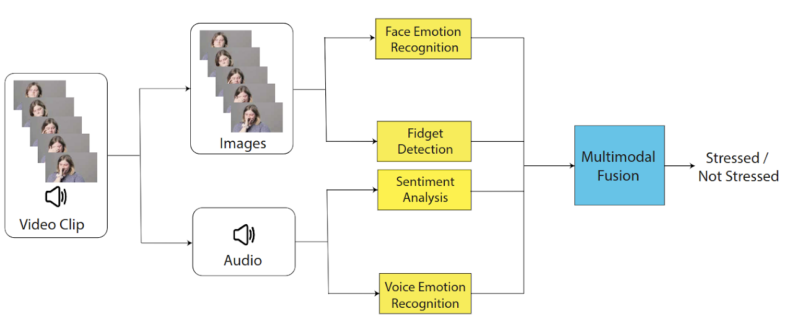

*indicates equal contribution

## Integrating Multimodal Affective Signals for Stress Detection from Audio-Visual Data
   
Debasmita Ghose\*, __Oz Gitelson__\*, Brian Scassellati

ACM International Conference on Multimodal Interaction, 2024 (__ICMI 2024__), San Jose, Costa Rica

<ul class="social-media-list">
<li>
<a href="https://drive.google.com/file/d/1YwhnJ8Oq1JTtsOZiKleKkPfPdOI4Er6D/view?usp=sharing" target="_blank">
    Paper
</a> 
</li>
<li>
<a href="https://sites.google.com/view/stress-detection-icmi-24" target="_blank">
    Website
</a> 
</li>
</ul>
